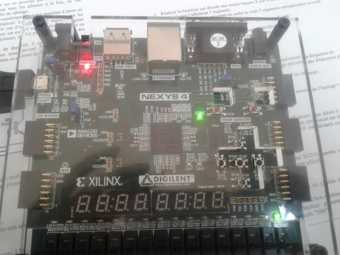

# fpga-first-steps

Introductory VHDL / FPGA coursework from my engineering studies in Tunisia (2017-2019), spanning
two different courses, boards, and toolchains.

This is where my FPGA/HDL exposure started, not a current or advanced project. For my active
embedded and FPGA work see [robot-joint-stack](https://github.com/sarahwer/robot-joint-stack)
(FreeRTOS, CAN FD, driver bring-up) and my Xilinx Zynq SoC project (VHDL, Vivado) built alongside
that portfolio.

## What's here

**Altera Cyclone III coursework (2017), Quartus II 9.0**, following Altera's official
["My First FPGA Design Tutorial"](docs/altera_my_first_fpga_tutorial.pdf):
- `counter/counter.vhd` -- a 32-bit free-running binary counter, the classic first VHDL exercise.
- `pll_mux_demo/` -- a small design combining a PLL (clock generation) and a multiplexer:
  - `p11_pll.vhd` -- PLL wrapper generated by Quartus's MegaWizard (auto-generated, not hand-written).
  - `counter_bus_mux.vhd` -- a 4-bit 2-to-1 multiplexer, also MegaWizard-generated.
  - `proj1_top.vhd` -- top-level counter entity tying the design together.
- `chenillard/chenillard.vhd` -- a hand-written 4-bit LED chaser ("chenillard"), a later exercise
  from the same course (a counter-driven shift pattern on a 4-bit output).
- `docs/` -- Altera's Cyclone III programming procedure and the official "My First FPGA Design
  Tutorial".

**Xilinx ISE / Nexys4 coursework ("Architecture des circuits programmables", ENET'COM Sfax,
2018-2019)**, a 4-lab sequence done with a lab partner (Hend Limème) on a Digilent Nexys4 board
(Xilinx Artix-7, xc7a100t) with Xilinx ISE 14.6 / PlanAhead:

- **TP1 -- Additionneur** (`adder/`): `demi_add.vhd` (half adder), `add1.vhd` (full adder), `add4.vhd`
  (4-bit ripple-carry adder built structurally from 4 instances of `add1`). Synthesized, placed &
  routed, and programmed onto the real board. Report: `docs/tp1_adder_report.pdf`.
- **TP2 -- Additionneur complet & décodeur 1 parmi 4** (not included as source): the same full-adder
  logic and a 1-of-4 decoder, but built by *schematic capture* (wiring AND/XOR/OR gate symbols in
  ISE's schematic editor) rather than text VHDL -- a different design-entry technique covered in
  the same course, not represented well as source files in a repo. `myand.vhd` (a 1-line AND-gate
  wrapper used as a schematic building block) is the only hand-written VHDL from this lab. Report:
  `docs/tp2_adder_decoder_report.pdf`.
- **TP3 -- Afficheur multiplexé** (`multiplexed_display/`): a 4-bit adder (reusing TP1's `add4`/`add1`
  from `adder/`) whose two operands, sum, and carry-out are each converted to 7-segment codes
  (`afficheur.vhd` / `afficheur1.vhd`, two BCD-to-7-segment decoder variants, plus an alternate
  `seg7.vhd`) and time-division multiplexed onto a single shared 7-segment digit
  (`tp3_top.vhd`, a clocked FSM cycling through 4 digit-select strobes AN0..AN3). This is the most
  structurally involved design in the repo: multiple components wired together plus a real
  multiplexing state machine, not just combinational logic. Report:
  `docs/tp3_multiplexed_display_report.pdf`.
- **TP4 -- Interfaçage VGA** (`vga/clockmodule.vhd`): a VGA sync/timing generator -- divides a 50 MHz
  input clock to the standard 25 MHz 640x480@60Hz pixel clock, generates HSYNC/VSYNC from
  horizontal/vertical pixel counters, and drives a checkerboard test pattern on RGB so the timing
  could be verified on a real monitor through the Nexys4's VGA port. Only the lab report survived
  for this one (no project files), so the VHDL is transcribed from the report's text -- see the
  note below. Report: `docs/tp4_vga_report.pdf`.

## Toolchain

Two different toolchains across these exercises: Quartus II 9.0 (2009) targeting an Altera Cyclone
III (EP3C-series) FPGA, and Xilinx ISE 14.6 (2013) targeting a Xilinx Artix-7 (xc7a100t) on a
Nexys4 board. Both are long superseded by current Quartus Prime / Cyclone 10 and by the
Xilinx/Vivado toolchain I use for current FPGA work -- though the ISE/Artix-7 exposure is at least
the same vendor family (Xilinx) as my current Zynq/Vivado project.

## A note on provenance

`adder/` and `multiplexed_display/` are copied from the original ISE project files (recovered from
an old project archive) and match what's in their lab reports exactly. `vga/clockmodule.vhd` is
different: only the PDF lab report survived for TP4, not the original project files, so that one
file was transcribed from the report's text rather than copied from source. It reads clean and
follows the report's own explanation of the design, but it hasn't been recompiled by me -- worth a
quick build check before relying on it.
